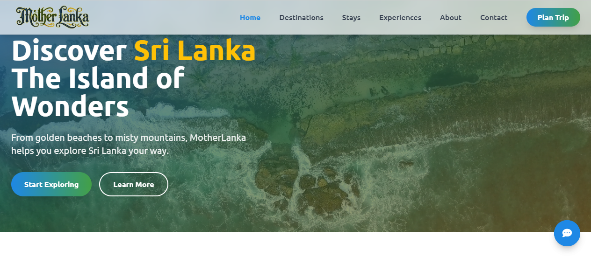

# 🇱🇰 MotherLanka

> **Discover the Beauty, Culture, and Heritage of Sri Lanka**
>
> Preview
>
> <p align="center">
  
</p>

MotherLanka is a modern web-based platform designed to showcase the beauty of Sri Lanka.  
The project highlights Sri Lankan tourism, culture, heritage, destinations, food, nature, and travel experiences through a clean and attractive user interface.

---

# ✨ Features

- Beautiful landing page
- Sri Lankan tourism-focused design
- Destination showcase
- Cultural and heritage highlights
- Nature and travel sections
- Responsive layout
- Smooth navigation
- Modern UI design
- Vercel deployment support
- Single Page Application support

---

# 🌍 Project Purpose

The main goal of MotherLanka is to promote Sri Lanka as a beautiful travel destination by presenting its natural beauty, cultural value, and tourist attractions in a visually appealing way.

This project can be used as:

- A tourism website
- A Sri Lankan culture showcase
- A travel landing page
- A portfolio web project
- A frontend design project

---

# 🛠️ Technology Stack

- HTML
- CSS
- JavaScript
- React / SPA structure
- Vercel deployment configuration

---

# 📁 Project Structure

```text
MotherLanka.github.io/
│
├── public/
├── src/
├── assets/
├── components/
├── README.md
├── vercel.json
└── package files
```

---

# 🚀 Getting Started

## Clone the Repository

```bash
git clone https://github.com/dinithrathnayaka23/MotherLanka.github.io.git
cd MotherLanka.github.io
```

---

# ⚙️ Installation

Install project dependencies:

```bash
npm install
```

---

# ▶️ Run Locally

Start the development server:

```bash
npm run dev
```

The project will usually run at:

```text
http://localhost:5173
```

---

# 🏗️ Build for Production

```bash
npm run build
```

---

# 🌐 Deployment

This project includes Vercel SPA rewrite configuration, so it can be deployed easily on Vercel.

```bash
vercel
```

Or connect the GitHub repository directly to Vercel and deploy automatically.

---

# 📌 Main Sections

- Home
- About Sri Lanka
- Tourist Destinations
- Culture & Heritage
- Nature & Wildlife
- Food & Lifestyle
- Gallery
- Contact

---

# 🌟 Highlights

- 🇱🇰 Sri Lankan identity-focused design
- 🏝️ Tourism and travel-friendly layout
- 📱 Fully responsive interface
- 🎨 Clean and attractive UI
- ⚡ Fast frontend performance
- 🌐 Easy deployment with Vercel

---

# 🔮 Future Enhancements

- Add destination search
- Add travel packages
- Add image gallery filtering
- Add contact form backend
- Add multilingual support
- Add Google Maps integration
- Add blog section
- Add admin dashboard for content updates

---

# 🎯 Vision

MotherLanka aims to promote Sri Lanka’s beauty, culture, and travel experiences through a simple, modern, and user-friendly digital platform.

---

# 🤝 Contributing

Contributions are welcome.  
You can fork the repository, make improvements, and submit pull requests.

---

# 📄 License

This project is created for educational and portfolio purposes.

---

## ⭐ Support

If you like this project, consider giving it a star on GitHub!
